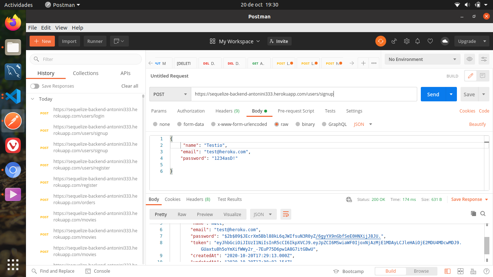
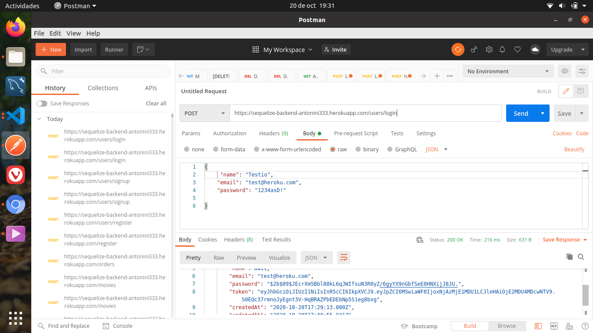
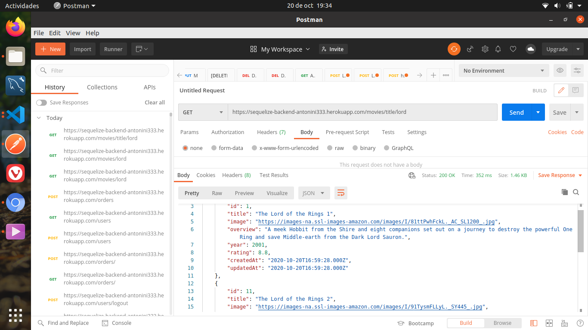
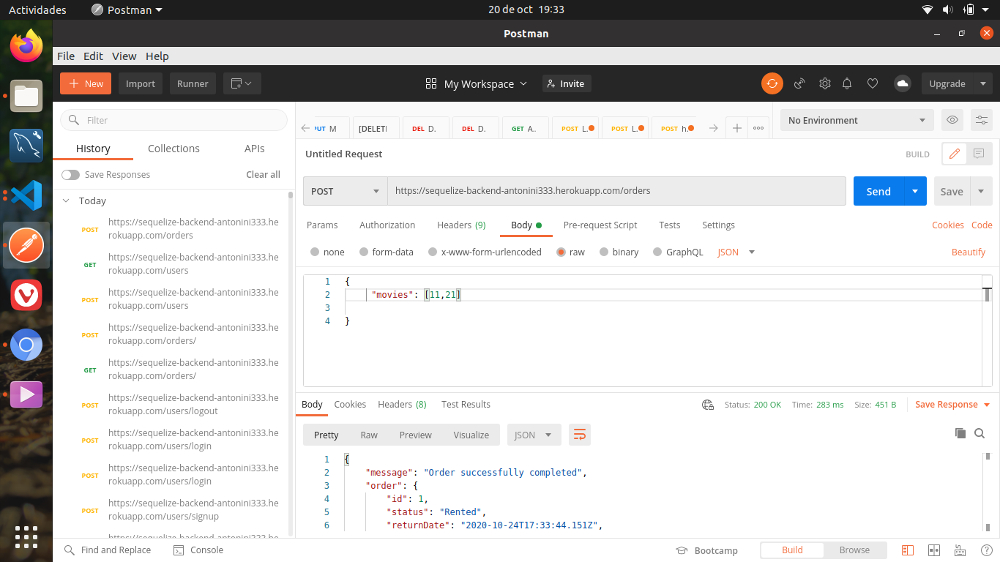

# SequelizeBackend

## Backend App designed to manipulate a movies webpage.  
Created with NodeJs in a express+mySQL+sequelize environment (and some dependencies like jsonwebtoken, axios or bcrypt)
Also it has been tested with Postman.

It consts of three featured main endpoints: 
+ #### Movies
+ #### Users
+ #### Orders.
 
 
 

### MOVIES:
 
   - You can go check this URL to see all the catalog at http://sequelize-backend-antonini333.herokuapp.com//movies
     
   - You can search the movies by his title adding the title or just the first letters at http://sequelize-backend-antonini333.herokuapp.com//movies/INSERT-TITLE-HERE.
    We have stored 3 differents movies containing the word "Lord of the Rings", so you could test the efficency of the searcher.
     
   + You also can search a movie by his numerical ID (21, 31, 41, 51...) at http://sequelize-backend-antonini333.herokuapp.com//movies/title/INSERT-NUMERICAL-ID-HERE
     
   - We got no frontend, but it is possible to create new movies just posting the movie attributes at the main URL http://sequelize-backend-antonini333.herokuapp.com//movies.
          
          
   

### USERS 
 
         This endpoints need some information by body, and since we haven't a frontend yet, it needs to be posted by some tool like Postman.
          
         + You can go to this URL http://sequelize-backend-antonini333.herokuapp.com//users/signup and, by posting a email and a new password, you'll be registered and your password will be encrypted and safely stored at our database.
           
          
         + Then you will be able to sign in at this URL http://sequelize-backend-antonini333.herokuapp.com//users/login with your email and password. Everytime you sign in, you will be gifted with a unique token to authenticate you. Once you're authenticated, you can start renting your first movie.
           
          
         + If you ever get bored, you can delete your account at http://sequelize-backend-antonini333.herokuapp.com//users/deleteuser by Postman, just giving your email and password. 
         

### ORDER 
 
     We still have any frontend, so this endpoints also will need some interactions with Postman.
         
  - You can check the rentals at http://sequelize-backend-antonini333.herokuapp.com/orders
          
 - If you want to rent a new movie, You will need to log in first. Once you're authenticated, you can to to this URL http://sequelize-backend-antonini333.herokuapp.com/orders) and, by posting "movie": and his numerical id, your rental will be confirmed and order with return date will be displayed.
 You can check out the movies id you want to rent at http://sequelize-backend-antonini333.herokuapp.com/movies     
 
 ## SIGN UP
 
  
 
 ## LOG IN
 
   
  
  ## SEARCH BY TITLE
  
  
 
 ## MOVIE RENTED
 
  
